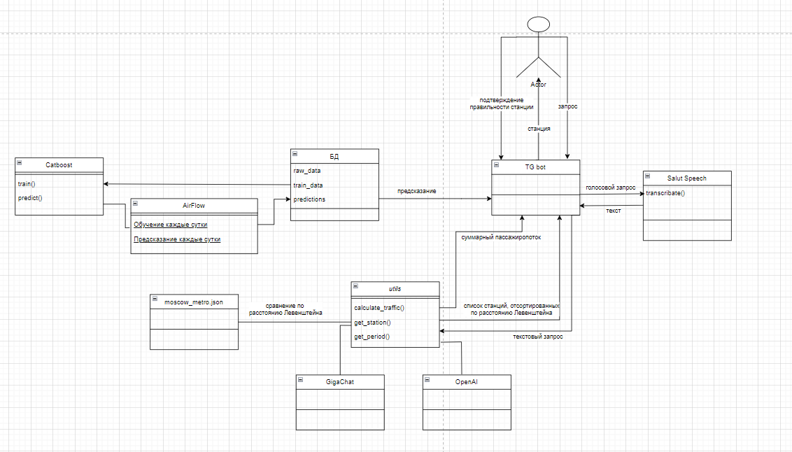

# Nuclear_hack - МосТрансПроект

Анализ и прогнозирование пассажиропотока на станциях метро

## Описание кейса

🟣 Проблематика

Цель данной задачи состоит в разработке и обучении ИИ модуля, способного анализировать и предсказывать пассажиропоток на станциях метро с использованием имеющихся данных.

Участникам хакатона предоставляется набор данных, содержащий показатели по пассажиропоток на различных станциях метро за определенный период времени.

Участникам рекомендуется использовать инструменты и технологии машинного обучения, обработки естественного языка (Natural Language Processing, NLP) и веб-разработки для реализации функционала модуля и пользовательского интерфейса.

🟣 Желаемый результат

Сервис в формате чат-бота, который может обрабатывать запросы в свободной текстовой или голосовой форме и выдавать пассажиропоток за запрашиваемые промежутки времени. 

## Данные

Данные о количестве пассажиров за 94 дня на каждой станции метро и МЦК

## Архитектура сервиса
 

## Команда REU DS CLUB

| Участник                       | bio       | Контакты                        |
|--------------------------------|-----------|---------------------------------|
| Пашинская Пелагея              | Team lead | https://t.me/polyanka003        |
| Ворогушин Максим               | SWE       | https://t.me/Maksoit            |
| Иванов Александр               | MLE       | https://t.me/lild1tz            |
| Мичурин Артем                  | DE        | https://t.me/amichurin_rubbles  |
